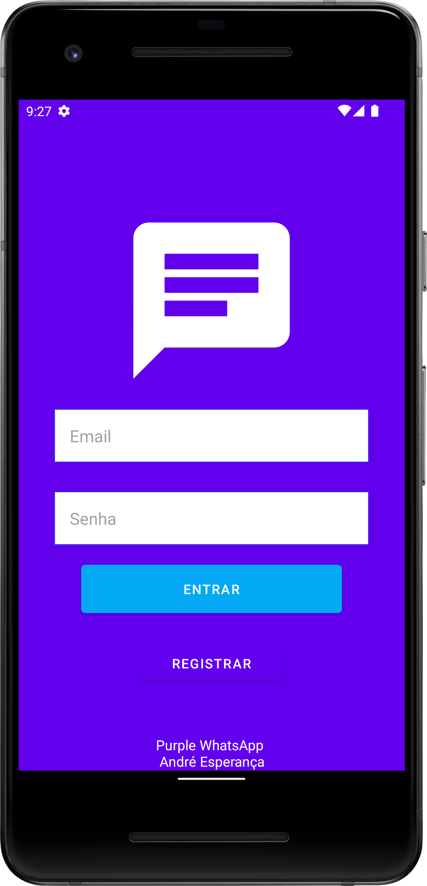
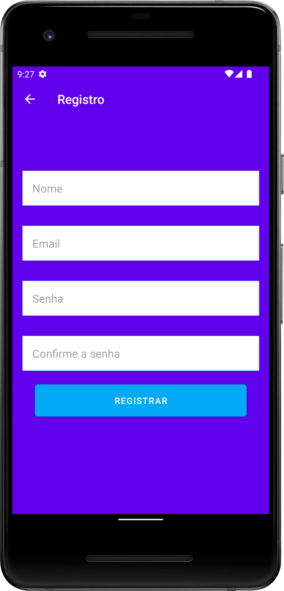
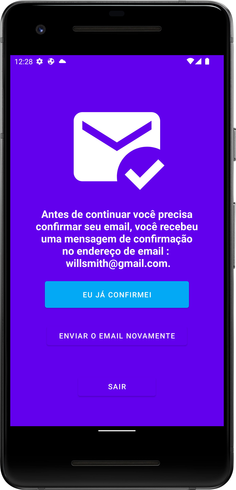
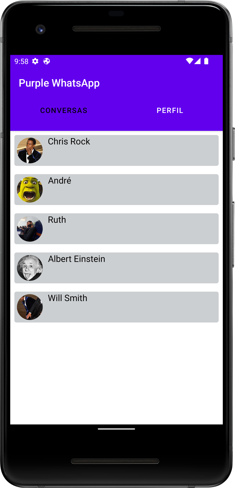
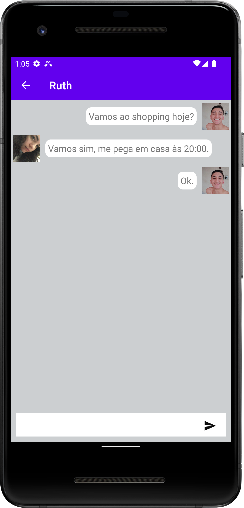
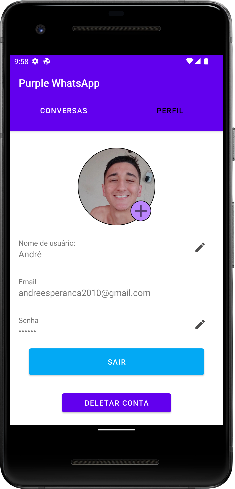
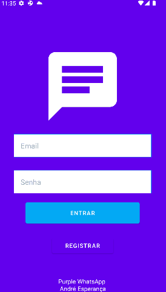

<h1 align="center">Purple WhatsApp - ChatApp </h1>

<h1 align="center">
  
  
  
  
  
  
  </h1>
  
  <h1 align="center">
  
  </h1>
  
  
  <h1 align="center">
   
  </h1>

<h1 align="center">
   
</h1>

### Sobre :book:
Aplicativo de chat baseado no WhatsApp, para aplicar conhecimentos aprendidos sobre Firebase.
 
 
 ### Tecnologias :rocket:

 - Kotlin 
 - Android Studio
 - Firebase ( FirebaseAuth/ FirebaseStore e FirebaseStorage)
 
 
 ### Funcionalidades 🛠

- [x] Criar autenticação e usuário no banco de dados.
- [x] Trocar nome/foto de usuário e opção de exclusão do mesmo.
- [x] Tirar foto com câmera/procurar na galeria ou excluir foto.
- [x] Verificação de email para ter acesso ao aplicativo.
- [x] ProgressBar simples.
- [x] Chat.
- [ ] Notificações.
- [ ] Refatorar código e adicionar uma arquitetura de projeto.

### Autor

Feito por André Esperança!

Contatos :
 

<a href="https://github.com/andreesperanca">
   
 
  
  <a href="https://github.com/andreesperanca" title="">André Esperança</a>
  
  
  
  
  

